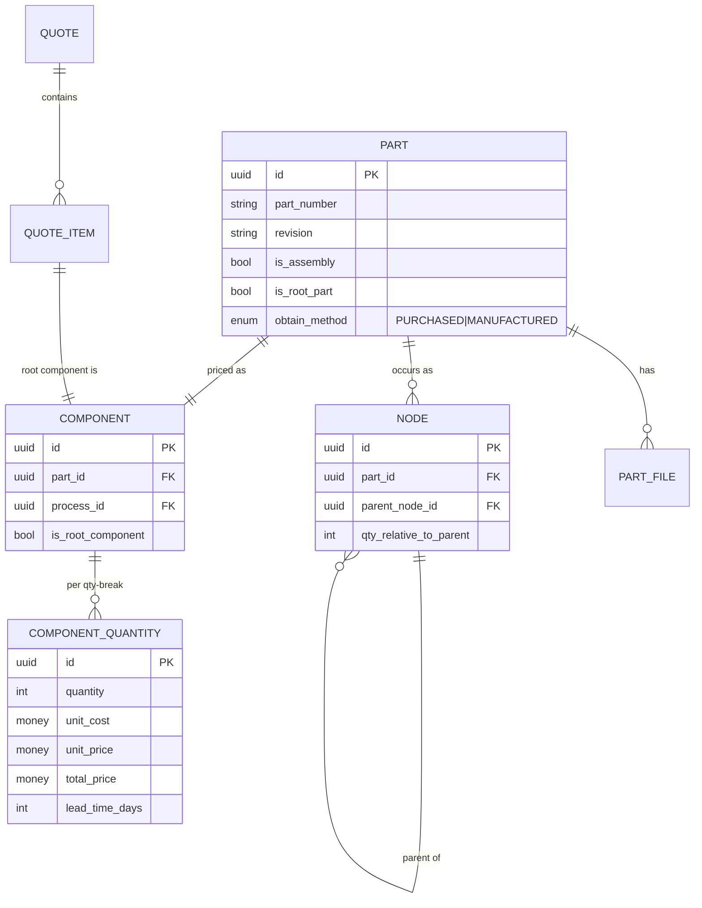
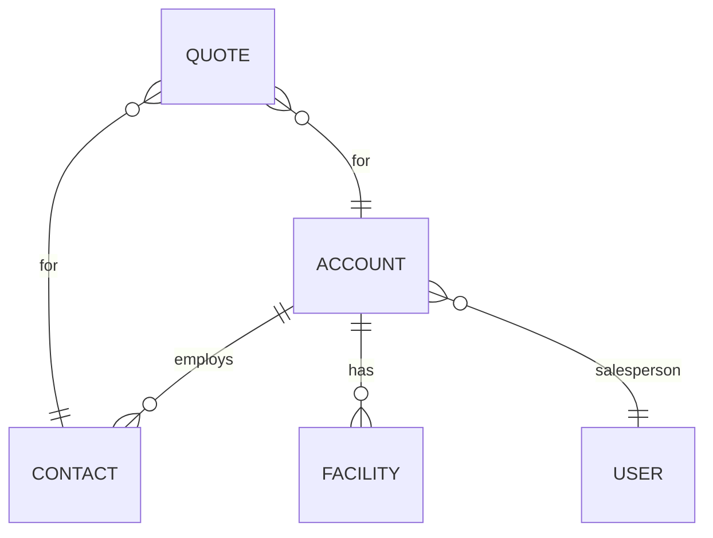
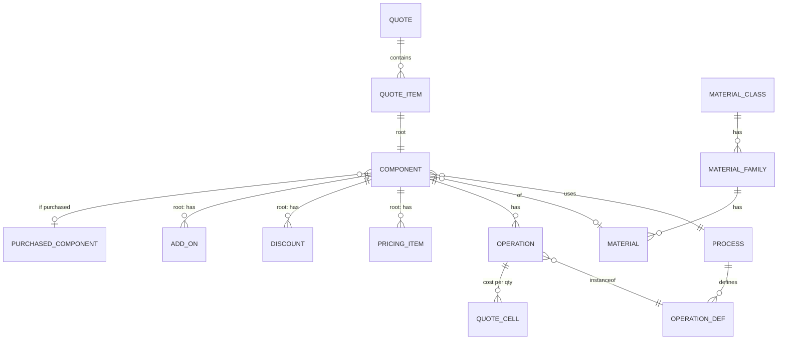

# Domain Model (reverse-engineered from the Paperless Parts KB)

**Status:** Spec appendix for Tolera (Bid Factory). **Provenance:** synthesized across the 186-article KB — primarily `assemblies-data-types-and-terminology`, `deep-copy-replace-referenced-part-faq`, `building-boms-additional-faq`, `accounts-and-contacts`, the P3L cheat sheets, and the `analytics-query-builder-deep-dive` (which doubles as PP's field dictionary). Reconciles with the spec's `Data Model` section. Implements Gap-Analysis recommendation #2.

> Names are the *semantics to implement*. Where the spec already has an entity, the reconciliation table (§7) maps it. Tolera/DACH deltas in §8.

---

## 1. The core abstraction — get this right first

Four layers, often conflated as "the part" in the UI but **distinct** in data. This separation is *the* reason the deep-copy / replace-referenced-part rules (E4-b) exist, and it's the backbone of quoting + assemblies.

| Layer | What it is | Holds | Lives in |
|---|---|---|---|
| **Part** | A physical thing (an assembly is also a Part) | Primary file, geometry, **BOM/assembly structure** | Part Library, Part Viewer |
| **Node** | An *occurrence* of a Part within an assembly tree | parent node ref + **quantity relative to parent** | the tree (multi-level BOM) |
| **Component** | A Part **with pricing** | materials, operations, customer-requested quantities, pricing logic that *references* the Part's geometry | Quotes page |
| **Quote Item** | The **root component** tied to a Quote + position | (it *is* the root component, plus quote linkage/position) | a Quote |

Key consequences (spec these as invariants):
- **Root node** has no parent and quantity = 1, linked to the **root Part**. **Root component ≈ Quote Item**; child components' costs **roll up** to it. Pricing items, add-ons, expedites, and the buyer-facing digital-quote data live **only on the root component**.
- The **multi-level BOM** = the list of Nodes; the **flat BOM** = the unique Parts. **Flat Qty** = total count of a part/component for customer qty 1; **Make Qty** is computed from tree position × requested quantities (and may exceed delivered qty, e.g. scrap).
- One Part may have **many Nodes**; all nodes (and the Part's one Component) **share** the underlying data — so a repeated part is quoted **once**. Selecting one node highlights all sibling nodes.
- A Part can be referenced by **multiple Quote Items** (incl. twice in one quote). Editing Part-level data then requires **Replace referenced part** or **Deep copy** (E4-b). **Duplicate quote item** shares the Part; **Deep copy** clones it (new library Part).
- **Extracting** a subcomponent to its own line item creates **new** Part + Component (pricing not shared), though it references the same uploaded file geometry.
- Editing the BOM on the quotes page edits the underlying Parts/Nodes (and the viewer's BOM tab), but **never** the original CAD tree (immutable; re-upload to reset).

---

## 2. Identity, Org & Users

- **Organization** (tenant): the shop. All data is org-scoped (multi-tenancy). Has `CompanyPreferences`/settings, facilities, branding.
- **User**: a login. **`UserOrgMembership`** (User ⋈ Org, M:N, role per membership) — see E4-a; active org = session state.
- **Role assignments on work:** a User appears as **Estimator** (on a Quote), **Salesperson** (on a Quote/Account), or **Component Estimator** (on a line item). These are **references to Users**, not separate tables. Fields: email, first/last/full name, job title, date joined, is_active.
- **Supplier/Send-from Facility** (settings-level): the shop's own facilities a quote is "sent from" — **distinct** from account Facilities (§3).

## 3. CRM — Accounts, Contacts, Facilities

- **Account** (company): `name`, `type` (**Customer | Vendor** — *Vendor accounts cannot be assigned to quotes*), `phone`/`ext`, `website`, `email`, `erp_code`, `salesperson` (User), `credit_line`, `payment_terms`, `tax_rate(s)`, `tax_exempt`, `purchase_orders_enabled`, `notes`, billing address, shipping address (auto-updated at digital-quote checkout).
- **Contact** (individual): belongs to **exactly one** Account; `email` (unique per org), `first/last/full name`, `phone`/`ext`, `notes`, `salesperson`. **Every Quote requires a Contact** (quote is emailed to them).
- **Facility** (account-level): `name`, `attention` (contact), address — a ship-to/location under an Account.

## 4. Intake — RFQ

- **RequestForQuote** (SmartRFQ submission): `business_name`, `email`, `first/last name`, `phone`, `description`, `referrer`, `marketing_source` (UTM), `requested_delivery_date`, `export_controlled`, `rfq_number`, `created`, `processed_on` → becomes a Quote.
- **RequestForQuoteView** (funnel analytics): per form view — has_started/finished contact-info & part-details, submitted file/source, submitted timestamp, uuid (ties to RFQ).

## 5. Quoting, Costing & Pricing

**Quote** — `number`, `revision`, `status` (§9), `rfq_number`, due date, dates (created/started/sent/expired/estimator-assigned/salesperson-assigned/digital-last-viewed/supplier-last-viewed), `send_from_facility`, `lead_time_display_units`, `private_notes`, `mark_sent_or_finalized`. Has many Quote Items; belongs to Account+Contact; Estimator+Salesperson (Users).

**Quote Item** — root-component link + `position`, `workflow_status` (§9), `was_won`/`won`, `export_controlled`, `expired_date`.

**Component** — `obtain_method` (MANUFACTURED|PURCHASED), `is_root_component`, `is_assembly`, links to **Part** + **Process**; carries Operations, Materials, Add-ons (root), Pricing Items (root), Discounts (root), Expedites/Lead Times (root). Child costs roll up.

**ComponentQuantity** (the richest entity — *recommend modeling explicitly*) — per quantity break: `quantity`, `make_quantity`, `deliver_quantity`, `unit_cost`, `calculated_unit_price`, `manual_unit_price`, `unit_price` (incl. discounts), `total_price`, cost split (`material/inside/outside/purchased_component/child_override/total`), `total_discount`(+%), `total_profit`(+ margin %), `lead_time`, `is_most_likely_won_quantity`(+%).

**Part / Node / PartFile / PartGeometry** — §1; PartFile = primary|supporting (E4-j); PartGeometry attributes per `PartGeometry-Attribute-Catalog.md`; **ExtractionFinding** = AI/Lens-extracted callouts/GD&T (spec entity).

**Process** — costing template that *generates operations*. `name`, `external_name` (shown on SmartRFQ/digital quote), `is_default_purchased_component_process`, `public`, op-factory class. Has OperationDefs, default Add-ons, default Pricing Items.

**OperationDef** — definition of an operation: `name`, `category` (operation|material), `is_outside_service`, `is_finish`, runtime/setup display units, Kalk cost formula, variables (`var`/`table_var`/`drop_down_var`). **Operation** = an OperationDef instance on a component (dynamic name, overrides). **QuoteCell** = an operation's cost per quantity break.

**Material hierarchy** — **MaterialClass** (Metal, Polymer, Composite, Sand, Wax, Additive) → **MaterialFamily** (Aluminum, Stainless…) → **Material** (Aluminum 6061-T6…). Components reference a Material; custom interrogations link by class/family/material.

**PurchasedComponent** — `oem_part_number`, `internal_part_number`, `piece_price`, `description`, `insertion_time`, + org-defined custom columns. Linked to a (purchased) Component.

**Pricing entities** (all have a per-quantity **Cell**):
- **PricingItem** (a.k.a. Profit Item) + **PricingItemCell**: markup/margin %, `category` (general/material/inside/outside/purchased_component), standard vs custom. Outputs `PERCENTAGE`.
- **Discount** + **DiscountCell**: % deduction after markups.
- **AddOn** + **AddOnCell**: line-item fee (required/optional), outputs `PRICE`. *(spec: add explicitly.)*
- **CustomCostCategory** + **Cell**: custom "color of money" (beta).
- **CustomTable** + rows: lookup tables for Kalk `table_var`/`table_lookup` (alphanumeric columns).
- **Nest** (sheet-metal/linear): nesting result grouping components (`manual_nest()`).

## 6. Orders, Workflow, Collaboration

- **Order** — created from a won Quote (PO or checkout). `number`, `status` (§9), totals, expedite fees, dates. Has **OrderItems** (`quantity`, `unit_price`, `total_price`, `shipping_price`, `expedites_fee`, `ships_on`). **OrderAdjustment/OrderHistory** = post-order changes (spec entity).
- **WorkflowStepDef** (per-org) + Quote-Item `workflow_status`; the 4-stage Draft tracker (spec).
- **Rule** + **ReviewItem** — requirements-review engine: a Rule (signals + filters + resolution options) raises ReviewItems on quotes/line-items. **Task** (assignee + due date + email) vs **@mention** (in-app). **Notification** (cross-org per E4-a).
- **Collaboration/Sourcing** (spec entities): Channel/Message/Annotation (TEAM vs EXTERNAL), ExternalShare (tokened), SupplierIntegration/FastenerSourcing, Vendor RFQ portal (Tolera net-new), PartFile redaction.

## 7. Reconciliation vs the Bid Factory spec `Data Model`

| KB entity | Spec entity | Status / action |
|---|---|---|
| Part / Node / Component / Quote Item (4 layers) | `LineItem (Part / Quote Item)` + `BomNode` + `Component/ComponentsLibrary` | 🟡 **Make the 4-layer split explicit.** Spec's `LineItem` conflates Part+QuoteItem; KB separates Part, Node, Component, QuoteItem (root component = quote item). This is the basis of E4-b/-j correctness. |
| **ComponentQuantity** | (per-qty values, JSONB-hinted) | 🟡 **Add as a first-class entity** — it's where cost/price/profit/lead-time per break live (and the richest analytics entity). |
| Account, Contact | `Account & Contact` | ✅ Aligned. Add: Account.type=Customer\|Vendor (vendors not quotable), payment_terms, credit_line, tax fields, PO-enabled. |
| Account **Facility** vs **Send-from/Supplier Facility** | (facilities) | 🟡 **Two distinct entities** — account ship-to vs the shop's own facility on a quote. Disambiguate. |
| Estimator / Salesperson / Component-Estimator | (roles) | ✅ Model as **User refs with role**, not tables. |
| PartGeometry / ExtractionFinding | `PartGeometry`, `ExtractionFinding` | ✅ Aligned (see `PartGeometry-Attribute-Catalog.md`). |
| Process / OperationDef / Operation / QuoteCell | `Process & OperationDef` | ✅ Add **Operation** (instance) and **QuoteCell** (per-qty op cost) explicitly. |
| MaterialClass→Family→Material | (materials) | 🟡 **Model the 3-level hierarchy** (interrogations + DACH DIN mapping depend on it). |
| PurchasedComponent | `Component/ComponentsLibrary`, `SupplierIntegration` | ✅ Add custom columns + `insertion_time`. |
| PricingItem(+Cell), Discount(+Cell), CostCategory | `CostCategory, PricingItem & Discount` | ✅ Add the per-qty **Cell** entities + **AddOn(+Cell)** + **CustomCostCategoryCell**. |
| AddOn(+Cell) | (Add-Ons section) | 🟡 **Add as data entities** (not just UI). |
| CustomTable | `Custom Tables` (Configure) | ✅ Aligned. |
| Nest | `Nest` | ✅ Aligned. |
| RequestForQuote / RequestForQuoteView | `Smart RFQ Form` | 🟡 **Add RFQ + RFQView entities** (intake + funnel analytics). |
| Order / OrderItem / OrderAdjustment | `OrderAdjustment & OrderHistory` | ✅ Add **Order** + **OrderItem** explicitly. |
| WorkflowStepDef, Rule, ReviewItem, Task, Notification | `WorkflowStepDef & Rule`, Review Items | ✅ Aligned; add Task vs @mention distinction + cross-org Notification (E4-a). |
| Organization, User, **UserOrgMembership** | (tenancy, `{auth}`) | 🟡 **Add UserOrgMembership** (E4-a). |
| Channel/Message/Annotation, ExternalShare, SupplierIntegration | `Collaboration & Sourcing entities` | ✅ Aligned. |
| EmailTemplate, QuoteDisplaySettings, CompanyPreferences | `Settings / Output entities` | ✅ Aligned. |

**Net:** the spec's data model is ~85% aligned. The high-value additions are (1) the explicit **Part/Node/Component/QuoteItem** 4-layer split with root-component=quote-item, (2) **ComponentQuantity** as a first-class per-break entity, (3) the **per-quantity Cell** entities for pricing/discount/add-on, (4) the **Material 3-level hierarchy**, (5) **RFQ/RFQView**, and (6) the two **Facility** types.

## 8. Status enums (seed)

- **Quote.status:** draft · sent · won · lost · (expired) — plus `mark_sent_or_finalized` (finalized vs mark-sent).
- **QuoteItem.workflow_status:** in progress · on hold · completed · … (org-configurable via WorkflowStepDef).
- **Order.status:** confirmed · cancelled · …
- **Component.obtain_method:** MANUFACTURED · PURCHASED.
- **Account.type:** Customer · Vendor.
- **OperationDef.category:** operation · material (+ `is_finish`, `is_outside_service` flags).
- **MaterialClass:** Metal · Polymer · Composite · Sand · Wax · Additive.

## 9. Tolera / DACH notes

- Keep PP entity names (Quote, Component, Part…); P3L→**Kalk**; "Profit Item"→keep or rename to PricingItem (spec uses PricingItem).
- **Export-controlled** flags (`line_item.is_export_controlled`, quote/RFQ `export_controlled`) → reframe as **EU dual-use / GDPR** handling, not ITAR.
- Money fields → **EUR**, de-DE formatting; tax fields → **MwSt/USt** + VIES/reverse-charge (per your VAT decisions).
- **Cells = per-quantity-break** rows: confirm the storage pattern (your audit hinted JSONB) — the analytics layer treats each cell/quantity as a row, so a normalized `*_cell` table per quantity is cleaner than JSONB for reporting.
- **Ignore** the many analytics fields the KB marks *broken/deprecated* — don't model them.

**Sources:** `assemblies-data-types-and-terminology`, `building-boms-additional-faq`, `deep-copy-replace-referenced-part-faq`, `swap-primary-and-supporting-files`, `accounts-and-contacts`, `analytics-query-builder-deep-dive`, the P3L cheat sheets (`operation-/pricing-items-/add-ons-/discounts-/custom-table-p3l`), `intro-to-the-assembly-toolkit` — all in `paperless-parts-kb-reference/`.
