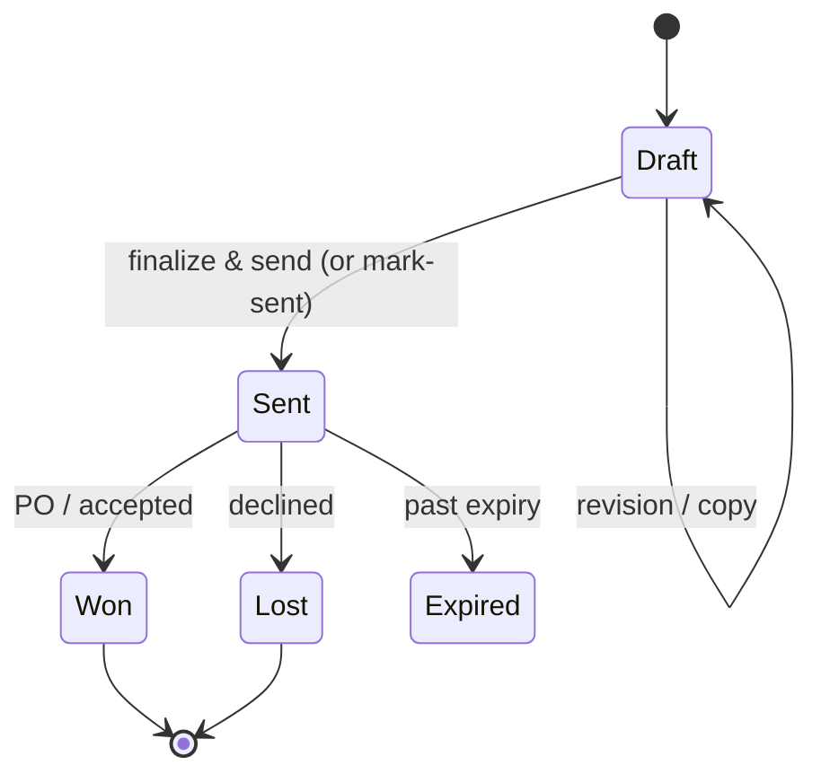
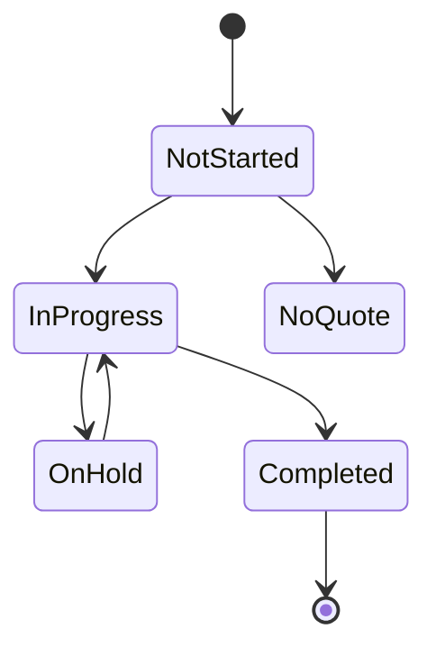
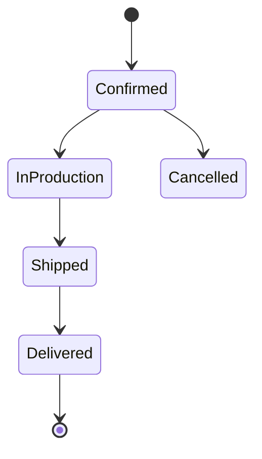

# User Stories, Workflow Choreography & State Machines

**Status:** Spec appendix for Tolera (Bid Factory). Implements Gap-Analysis rec #5. **Provenance:** the KB how-to articles + the spec's screen specs, demos (DemoA–O), `workflows`, `tasks`, quote lifecycle. **Acceptance** ties to the `SEED-AND-FIXTURES.md` goldens (numbers) and the Demo screenshots (visual baselines).

> Format: `As a <role>, I want <capability>, so that <outcome>.` + **AC** (Given/When/Then) + source. The backbone (roles → choreography → state machines) is exhaustive; the stories cover the core flows — extend any KB how-to into a story with the same template.

---

## 1. Roles
- **Salesperson** — owns the account relationship; receives RFQs, assigns, sends quotes.
- **Estimator** (incl. Component Estimator) — builds quotes, runs interrogation/Kalk, sets pricing.
- **Purchasing / Buyer** — sources purchased components + outside services (Vendor RFQ).
- **Shop-floor / Manager** — reviews manufacturability, approves before send.
- **Admin** — Configure (processes, ops, materials, rules, users, integrations).
- **External buyer** — the customer on the Digital Quote (checkout).
- **Vendor** — external supplier on the Vendor RFQ portal.

## 2. State machines

**Quote lifecycle**

**Line-item / component workflow status** (completion tracker; rolls up to quote %)

Rollup: quote `In Progress %` = completed ÷ applicable line items; any `On Hold` item → quote shows On Hold; `No Quote` counts as completed for rollup but is unselectable on the Digital Quote.

**Order lifecycle**

**RFQ:** Received → Processed → (Quote created). **Task:** Open → Overdue → Resolved (↺ Reopen). **Review item:** Open → Resolved.

## 3. End-to-end choreography (4-role flow, RFQ → order)

1. **Intake** — RFQ arrives via Smart RFQ form or email (`{slug}@rfq.tolera.eu`). Lens parses contact/part/qty; creates Quote (Draft), attaches files, runs interrogation + extraction. *Salesperson* assigns an *estimator* (Task/@mention).
2. **Setup** — *Estimator* confirms part fields (Lens suggestions via AI Governor), material, process; geometry interrogated; "Found in Files" + DFM warnings reviewed; **Review Items** raised by Rules.
3. **Cost** — Kalk runs per operation × quantity; estimator overrides where confidence is low (5-axis, GD&T). Line-item status → In Progress.
4. **Source** — *Purchasing* sends **Vendor RFQs** for purchased components / outside services; vendor quotes return and slot into cost.
5. **Price** — estimator applies pricing items (markup/margin), discounts, add-ons, expedite/lead-time options.
6. **Review/Approve** — line items → Completed; **Manager** reviews flagged Review Items; resolves before send (handoffs via Tasks/@mentions; chat history carries forward on requote).
7. **Send** — *Salesperson* finalizes → Digital Quote sent (or mark-sent); status → Sent.
8. **Buy** — *External buyer* opens Digital Quote, picks quantity + lead-time option, checks out (PO/SEPA/QR-bill) → Order (Confirmed); Quote → Won.
9. **Fulfil** — Order moves Confirmed → In Production → Shipped → Delivered; post-order changes via OrderAdjustment.

## 4. Epics & user stories (with acceptance criteria)

### E1 — Intake
- **S1.1 Email RFQ ingest.** *As a salesperson, I want RFQ emails auto-converted to draft quotes, so that nothing is retyped.* **AC:** Given an email to `{slug}@rfq.tolera.eu` with CAD/PDF + ZIP attachments, When received, Then a Draft quote is created, sender matched/created as Contact, files attached & processing started, `rfq_received_date` set. *(KB: email ingest; E4 two-way threading.)*
- **S1.2 Smart RFQ form.** *As a buyer, I want to submit parts + details online, so that I get a quote faster.* **AC:** Given the embeddable form, When I submit contact + files + qty + requested date, Then an RFQ + Draft quote is created and the funnel (view→submit) is tracked. *(KB: the-smart-rfq-form.)*

### E2 — Quote setup & part analysis
- **S2.1 Part-field suggestions.** *As an estimator, I want Lens to suggest part #/rev/desc/material/units, so that setup is fast.* **AC:** suggestions appear as purple (55% opacity) and apply only on Accept; never auto-applied to cost. *(KB: Found-in-files; PDF-Extraction-Beta.)*
- **S2.2 Geometry interrogation.** *As an estimator, I want the part auto-analyzed for its process, so that cost drivers populate.* **AC:** Given a Core-4 single-body file + process, When interrogated, Then dimensions/features/feedback match goldens within tolerance; assemblies are decomposed first. *(KB: interrogations-basics; INTERROGATION-ENGINE-SPEC.)*
- **S2.3 Found in Files + whiteout.** *As an estimator, I want GD&T/callouts extracted and overlaid, so that I don't miss requirements.* **AC:** findings grouped into 5 categories, clickable to source, whiteout isolates a category, "build rule" available. *(KB: Found-in-files-extractions.)*
- **S2.4 Swap primary file.** *As an estimator, I want to make a CAD model the primary file over a PDF, so that geometry autofills.* **AC:** double-arrow swaps; blocked when part is multiply-referenced (→ Replace referenced part) or BOM structures differ. *(KB: swap-primary-and-supporting-files; E4-b/-j.)*

### E3 — Costing & pricing (Kalk)
- **S3.1 Operation costing.** *As an estimator, I want each operation costed per quantity, so that price reflects make qty.* **AC:** Kalk `COST`/`DAYS` per op × qty; child costs roll up to root; results match goldens. *(PRICING-ENGINE-SPEC §3.)*
- **S3.2 Override with confidence.** *As an estimator, I want to override low-confidence runtimes, so that 5-axis/complex parts are correct.* **AC:** override applies at the variable freeze point; calc value preserved separately. *(KB: milling-process; KALK-REFERENCE.)*
- **S3.3 Markup/margin pricing items.** *As an estimator, I want markup/margin by cost category, so that pricing matches strategy.* **AC:** margin `Sell=Cost/(1−pct)`, markup `Sell=Cost×(1+pct)`; per-category; custom pricing items via `get_components()`. *(KB: pricing-items-p3l; DemoE.)*
- **S3.4 Discounts & add-ons.** **AC:** discount % applied after markups (`unit×(1−d%)`), add-ons after discounts; `unit×qty=total`. *(KB: discounts; add-ons.)*
- **S3.5 Dynamic lead times.** *As an estimator, I want relative days-faster + % expedite options, so that buyers choose time-vs-money.* **AC:** apply-to-all + per-item; shown highest-price-first on Digital Quote. *(KB: dynamic-lead-times-guide; E4-c.)*
- **S3.6 Config-change freeze.** *As an estimator, existing drafts must not silently re-price.* **AC:** config edits don't change open drafts; Regenerate Operations / Refresh / Bulk Refresh opt-in; overrides preserved on Refresh. *(E4-d.)*

### E4 — Assemblies & BOM
- **S4.1 BOM Builder.** *As an estimator, I want a PDF BOM turned into a hierarchical BOM, so that I can quote assemblies.* **AC:** split → detect → extract → child BOMs → publish; published tree matches golden. *(KB: The-BOM-Builder.)*
- **S4.2 Repeat part quoted once.** **AC:** a part with multiple nodes shares one component; make-qty computed from tree × requested qty; editing it triggers deep-copy guard when multiply-referenced. *(KB: assemblies-data-types; deep-copy FAQ.)*

### E5 — Review & rules
- **S5.1 Requirements review.** *As a manager, I want rules to flag critical requirements, so that the team is consistent.* **AC:** a Rule (signals+filters+resolutions) raises Review Items on quote/line-item; signals include DFM warnings + Lens findings; resolved before send. *(KB: requirements-review; building-review-rules.)*

### E6 — Collaboration
- **S6.1 Tasks.** *As an estimator, I want to assign a task with a due date on a part, so that handoffs are tracked.* **AC:** task = assignee + due date + message (+ annotation); email + in-app notify; Tasks page filter by assignee/status/quote; reopen/resolve. *(KB: tasks.)*
- **S6.2 Team vs external chat + annotations.** **AC:** TEAM and EXTERNAL channels; 2D/3D annotations; external share via tokened link (expiry/revoke). *(KB: internal/external collaboration.)*

### E7 — Send & Digital Quote
- **S7.1 Send quote.** *As a salesperson, I want to finalize and send, so that the buyer gets a Digital Quote + PDF.* **AC:** preconditions checked (contact present, items complete or warning acknowledged); status → Sent; white-label A4 PDF (EUR + MwSt). *(KB: sending-quotes; the-digital-quote.)*
- **S7.2 Buyer checkout.** *As a buyer, I want to select qty + lead time and place a PO, so that I order.* **AC:** option selection updates price; PO/SEPA/QR-bill checkout → Order; Quote → Won; shipping/billing captured. *(KB: online-checkout; order-facilitation.)*

### E8 — Sourcing / Vendor RFQ (net-new)
- **S8.1 Outbound vendor RFQ.** *As purchasing, I want to RFQ vendors for outside services/purchased parts, so that cost is real.* **AC:** batch send → vendor portal (unauth, soft cutoff) → quotes return → slot into Kalk; in-flight status chip + workflow-stage warning. *(spec Vendor RFQ Portal.)*

### E9 — Config / Admin / Onboarding
- **S9.1 First-run Quick Setup.** *As an admin, I want a guided setup pre-filled from the seed, so that I can quote on day one.* **AC:** seed catalog provisions ops/processes/materials/rules; Quick Setup checklist; missing-operation-rates soft warning. *(SEED-AND-FIXTURES; spec onboarding.)*
- **S9.2 Custom interrogation.** *As an admin, I want per-material DFM thresholds, so that warnings fit my shop.* **AC:** thresholds editable, linked by material class/family/material + op; most-specific match applied. *(KB: custom-interrogations; DFM-WARNINGS.)*

### E10 — Analytics
- **S10.1 Query builder.** *As a manager, I want to build queries from measures + dimensions, so that I understand the shop.* **AC:** measures aggregate by dimensions, time + filters, save to dashboards; win rate + draft-to-send tiles in the default dashboard. *(KB: analytics; E4-k.)*

## 5. Acceptance ↔ fixtures & screenshots
- **Numeric** acceptance (S2.2, S3.x, S4.x) binds to `SEED-AND-FIXTURES.md` goldens (interrogation/pricing/BOM).
- **Visual** acceptance binds to the Demo screenshots (DemoA–O Screenshot Index) as layout/behavior baselines.
- **Per-demo DoD** in the spec's Acceptance Criteria section stays the integration test; these stories are the per-feature unit of work beneath them.

## 6. DACH notes
German UI strings; metric/mm; EUR/CHF + MwSt on quotes; DIN materials in pickers; export-control reframed as dual-use in rules/RFQ; e-invoice (ZUGFeRD/XRechnung) on the Order/invoice path (DACH-DELTA).

**Sources:** `the-smart-rfq-form`, `Found-in-files-extractions`, `interrogations-basics`, `swap-primary-and-supporting-files`, `pricing-items-p3l-cheat-sheet`, `discounts`, `dynamic-lead-times-guide`, `working-with-existing-quotes-after-an-update-to-pricing-configuration`, `The-BOM-Builder`, `assemblies-data-types-and-terminology`, `requirements-review`, `building-review-rules`, `tasks`, `internal-collaboration`, `sending-quotes`, `the-digital-quote`, `online-checkout-in-paperless-parts`, `order-facilitation`, `workflows`, `custom-interrogations`, `analytics` (all in `paperless-parts-kb-reference/`).
